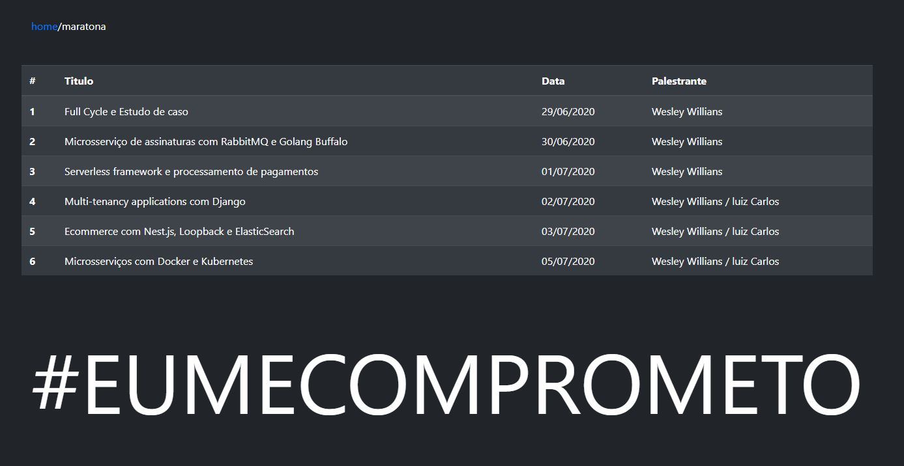

# django-challenger

### Prerequisites

```
- python
- django
- docker
```

### Installing

Open the terminal and execute the commands

- downloading image

```
docker pull thiagojsimaome/django-challenger:latest
```

## The project

Simple list page using django.

Main page :


List page :



## Start image

```
Favor utilizar a  tag [:latest]

docker run -p 8000:8000 thiagojsimaome/django-challenger:latest
```

## start locally

```
python manage.py runserver
```

## Author

-   [**thiago-js**](https://github.com/thiago-js)
